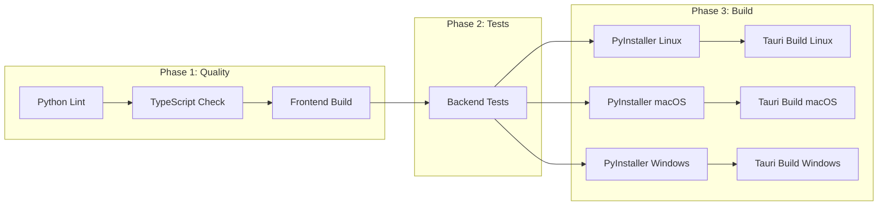

# Plan 4: Tauri Desktop Application Packaging

> **Phase**: 4 of 4 (After Plans 2 & 3 are complete)  
> **Depends on**: Plans 2 + 3 (working backend API + working frontend)  
> **Estimated Effort**: ~8 hours  
> **Output**: A single-click installable desktop app for Windows, Linux, macOS with zero user configuration

---

## 1. Goal

Package PaperQuant as a **Tauri v2 desktop application** that:
- Bundles the React frontend as the native WebView content
- Manages the Python FastAPI backend as a **sidecar process** (bundled via PyInstaller)
- Installs on Windows, Linux, and macOS with a single installer/binary
- Requires **zero manual configuration** — no Python install, no npm, no terminal commands
- Auto-discovers a free port, launches the backend, connects the frontend, and shuts down cleanly

---

## 2. Architecture Overview

```
┌─────────────────────────────────────────────────────────────────┐
│                        Tauri Application                        │
│                                                                 │
│  ┌────────────────────────────────────┐                         │
│  │        Rust Core (src-tauri/)      │                         │
│  │                                    │                         │
│  │  1. Spawn Python sidecar binary    │                         │
│  │  2. Capture stdout for port        │                         │
│  │  3. Inject port into WebView       │                         │
│  │  4. Manage sidecar lifecycle       │                         │
│  │  5. Clean shutdown on app close    │                         │
│  └────────────┬───────────────────────┘                         │
│               │ manages                                         │
│               ▼                                                 │
│  ┌────────────────────────────────────┐                         │
│  │   Python Sidecar (PyInstaller)    │                         │
│  │                                    │                         │
│  │   api_server binary               │                         │
│  │   ├── FastAPI + Uvicorn           │                         │
│  │   ├── ProcessManager              │                         │
│  │   │   ├── Price_adapter           │                         │
│  │   │   ├── Trade_adapter           │                         │
│  │   │   └── Strategy runners        │                         │
│  │   ├── ZMQ + DiskCache + SQLite    │                         │
│  │   └── All Python dependencies     │                         │
│  └────────────────────────────────────┘                         │
│                                                                 │
│  ┌────────────────────────────────────┐                         │
│  │   WebView (React Frontend)        │                         │
│  │                                    │                         │
│  │   Built dist/ served locally      │                         │
│  │   Communicates via HTTP + WS      │                         │
│  │   to localhost:{PORT}             │                         │
│  └────────────────────────────────────┘                         │
└─────────────────────────────────────────────────────────────────┘
```

---

## 3. Prerequisites

Before starting this phase:
- [ ] Plan 2 complete: Backend FastAPI server works standalone
- [ ] Plan 3 complete: Frontend builds clean and communicates via HTTP/WS
- [ ] Backend `api_server.py` prints `PAPERQUANT_PORT=XXXXX` to stdout on startup
- [ ] Frontend reads port from `window.__PAPERQUANT_PORT__`

---

## 4. New Directory Structure

```
PaperQuant/
├── src-tauri/                          ← [NEW] Tauri Rust project
│   ├── Cargo.toml                      ← Rust dependencies
│   ├── tauri.conf.json                 ← Tauri configuration
│   ├── build.rs                        ← Build script
│   ├── capabilities/
│   │   └── default.json                ← Permissions (shell plugin)
│   ├── icons/                          ← App icons for all platforms
│   │   ├── icon.png
│   │   ├── icon.ico
│   │   ├── icon.icns
│   │   ├── 32x32.png
│   │   ├── 128x128.png
│   │   └── 128x128@2x.png
│   ├── binaries/                       ← [PyInstaller output goes here]
│   │   ├── paperquant-server-x86_64-pc-windows-msvc.exe
│   │   ├── paperquant-server-x86_64-unknown-linux-gnu
│   │   └── paperquant-server-aarch64-apple-darwin
│   └── src/
│       ├── main.rs                     ← Tauri app entry: sidecar management
│       └── lib.rs                      ← Tauri commands
├── scripts/
│   ├── build-sidecar.py               ← [NEW] PyInstaller build script
│   ├── paperquant.spec                ← [NEW] PyInstaller spec file
│   └── build-all.sh                   ← [NEW] Full build pipeline
├── UI/Frontend/                        ← React app (Tauri frontend source)
├── api_server.py                       ← Python entry point (PyInstaller target)
└── ...
```

---

## 5. Detailed Implementation Tasks

### 5.1 Task 1: Initialize Tauri v2 Project

```bash
# Install Tauri CLI
cargo install create-tauri-app
npm install -g @tauri-apps/cli@^2

# Initialize in PaperQuant root
cd /mnt/Data/Coding/PaperQuant
npm create tauri-app@latest -- --template react-ts
# Or manually scaffold:
```

**File: `src-tauri/Cargo.toml`**

```toml
[package]
name = "paperquant"
version = "0.2.0"
edition = "2021"

[lib]
name = "paperquant_lib"
crate-type = ["staticlib", "cdylib", "rlib"]

[build-dependencies]
tauri-build = { version = "2", features = [] }

[dependencies]
tauri = { version = "2", features = [] }
tauri-plugin-shell = "2"
serde = { version = "1", features = ["derive"] }
serde_json = "1"
```

---

### 5.2 Task 2: Configure Tauri

**File: `src-tauri/tauri.conf.json`**

```json
{
  "$schema": "https://raw.githubusercontent.com/nicegui/nicegui/refs/heads/main/nicegui/templates/tauri.conf.schema.json",
  "productName": "PaperQuant",
  "version": "0.2.0",
  "identifier": "com.paperquant.desktop",
  "build": {
    "beforeDevCommand": "cd UI/Frontend && npm run dev",
    "devUrl": "http://localhost:5173",
    "beforeBuildCommand": "cd UI/Frontend && npm run build",
    "frontendDist": "UI/Frontend/dist"
  },
  "app": {
    "title": "PaperQuant",
    "windows": [
      {
        "title": "PaperQuant — Paper Trading Platform",
        "width": 1280,
        "height": 800,
        "minWidth": 1024,
        "minHeight": 600,
        "resizable": true,
        "fullscreen": false,
        "center": true
      }
    ],
    "security": {
      "csp": "default-src 'self'; connect-src 'self' http://127.0.0.1:* ws://127.0.0.1:*; script-src 'self' 'unsafe-inline'"
    }
  },
  "bundle": {
    "active": true,
    "targets": "all",
    "icon": [
      "icons/32x32.png",
      "icons/128x128.png",
      "icons/128x128@2x.png",
      "icons/icon.icns",
      "icons/icon.ico"
    ],
    "externalBin": [
      "binaries/paperquant-server"
    ],
    "resources": [],
    "category": "Finance",
    "shortDescription": "Paper trading platform for algorithmic traders",
    "longDescription": "PaperQuant is an open-source paper trading platform for algorithmic traders. Write Python strategies, run them against real market data, and track performance with zero financial risk.",
    "windows": {
      "wix": {
        "language": "en-US"
      }
    },
    "macOS": {
      "minimumSystemVersion": "10.15"
    },
    "linux": {
      "deb": {
        "depends": []
      },
      "appimage": {
        "bundleMediaFramework": false
      }
    }
  },
  "plugins": {
    "shell": {
      "sidecar": true,
      "scope": [
        {
          "name": "binaries/paperquant-server",
          "sidecar": true,
          "args": true
        }
      ]
    }
  }
}
```

---

### 5.3 Task 3: Tauri Rust Code — Sidecar Management

**File: `src-tauri/src/main.rs`**

```rust
#![cfg_attr(not(debug_assertions), windows_subsystem = "windows")]

use tauri::Manager;
use tauri_plugin_shell::ShellExt;
use std::sync::Mutex;

struct AppState {
    backend_port: Mutex<Option<u16>>,
}

#[tauri::command]
fn get_backend_port(state: tauri::State<AppState>) -> Option<u16> {
    state.backend_port.lock().unwrap().clone()
}

fn main() {
    tauri::Builder::default()
        .plugin(tauri_plugin_shell::init())
        .manage(AppState {
            backend_port: Mutex::new(None),
        })
        .invoke_handler(tauri::generate_handler![get_backend_port])
        .setup(|app| {
            let app_handle = app.handle().clone();
            
            // Spawn Python sidecar
            let sidecar = app_handle
                .shell()
                .sidecar("paperquant-server")
                .expect("Failed to create sidecar command");
            
            let (mut rx, _child) = sidecar
                .spawn()
                .expect("Failed to spawn Python sidecar");
            
            // Listen for stdout to capture port
            let handle_clone = app_handle.clone();
            tauri::async_runtime::spawn(async move {
                use tauri_plugin_shell::process::CommandEvent;
                
                while let Some(event) = rx.recv().await {
                    match event {
                        CommandEvent::Stdout(line) => {
                            let line_str = String::from_utf8_lossy(&line);
                            
                            // Parse port from "PAPERQUANT_PORT=XXXXX"
                            if let Some(port_str) = line_str.strip_prefix("PAPERQUANT_PORT=") {
                                if let Ok(port) = port_str.trim().parse::<u16>() {
                                    // Store port in app state
                                    let state = handle_clone.state::<AppState>();
                                    *state.backend_port.lock().unwrap() = Some(port);
                                    
                                    // Inject port into all windows
                                    if let Some(window) = handle_clone.get_webview_window("main") {
                                        let js = format!(
                                            "window.__PAPERQUANT_PORT__ = {};",
                                            port
                                        );
                                        let _ = window.eval(&js);
                                    }
                                    
                                    println!("Backend started on port {}", port);
                                }
                            }
                        }
                        CommandEvent::Stderr(line) => {
                            eprintln!("Backend stderr: {}", String::from_utf8_lossy(&line));
                        }
                        CommandEvent::Terminated(status) => {
                            eprintln!("Backend process terminated with status: {:?}", status);
                        }
                        _ => {}
                    }
                }
            });
            
            Ok(())
        })
        .run(tauri::generate_context!())
        .expect("Error running PaperQuant");
}
```

---

### 5.4 Task 4: Capabilities Configuration

**File: `src-tauri/capabilities/default.json`**

```json
{
  "$schema": "../gen/schemas/desktop-schema.json",
  "identifier": "default",
  "description": "Capability for the main window",
  "windows": ["main"],
  "permissions": [
    "core:default",
    "shell:default",
    "shell:allow-spawn",
    "shell:allow-execute",
    {
      "identifier": "shell:allow-spawn",
      "allow": [
        {
          "name": "binaries/paperquant-server",
          "sidecar": true,
          "args": true
        }
      ]
    }
  ]
}
```

---

### 5.5 Task 5: PyInstaller Sidecar Build

**File: `scripts/paperquant.spec`**

```python
# -*- mode: python ; coding: utf-8 -*-
import os
import sys
from PyInstaller.utils.hooks import collect_all

block_cipher = None

# Collect all hidden imports for complex packages
zmq_datas, zmq_binaries, zmq_hiddenimports = collect_all("zmq")
yfinance_datas, yfinance_binaries, yfinance_hiddenimports = collect_all("yfinance")

a = Analysis(
    ["../api_server.py"],
    pathex=[".."],
    binaries=zmq_binaries + yfinance_binaries,
    datas=[
        ("../Indicators", "Indicators"),  # Include indicators package
        ("../Price_adapter", "Price_adapter"),  # Include price adapter
        ("../Trade_adapter.py", "."),  # Include trade adapter
        ("../Handler.py", "."),  # Include handler
    ]
    + zmq_datas
    + yfinance_datas,
    hiddenimports=[
        "diskcache",
        "uvicorn",
        "uvicorn.logging",
        "uvicorn.loops",
        "uvicorn.loops.auto",
        "uvicorn.protocols",
        "uvicorn.protocols.http",
        "uvicorn.protocols.http.auto",
        "uvicorn.protocols.websockets",
        "uvicorn.protocols.websockets.auto",
        "uvicorn.lifespan",
        "uvicorn.lifespan.on",
        "fastapi",
        "starlette",
        "pydantic",
        "websockets",
        "numpy",
        "pandas",
        "sqlite3",
    ]
    + zmq_hiddenimports
    + yfinance_hiddenimports,
    hookspath=[],
    hooksconfig={},
    runtime_hooks=[],
    excludes=["jupyter", "notebook", "ipython", "tkinter", "matplotlib"],
    win_no_prefer_redirects=False,
    win_private_assemblies=False,
    cipher=block_cipher,
    noarchive=False,
)

pyz = PYZ(a.pure, a.zipped_data, cipher=block_cipher)

exe = EXE(
    pyz,
    a.scripts,
    a.binaries,
    a.zipfiles,
    a.datas,
    [],
    name="paperquant-server",
    debug=False,
    bootloader_ignore_signals=False,
    strip=False,
    upx=False,  # Disable UPX to avoid ZMQ issues
    upx_exclude=[],
    runtime_tmpdir=None,
    console=True,  # Console mode for stdout port discovery
    disable_windowed_traceback=False,
    argv_emulation=False,
    target_arch=None,
    codesign_identity=None,
    entitlements_file=None,
)
```

**File: `scripts/build-sidecar.py`**

```python
#!/usr/bin/env python3
"""Build the PyInstaller sidecar binary for the current platform."""

import os
import sys
import platform
import subprocess
import shutil


def get_target_triple():
    """Determine the Tauri-compatible target triple for the current platform."""
    machine = platform.machine().lower()
    system = platform.system().lower()

    arch_map = {
        "x86_64": "x86_64",
        "amd64": "x86_64",
        "aarch64": "aarch64",
        "arm64": "aarch64",
    }
    arch = arch_map.get(machine, machine)

    if system == "linux":
        return f"{arch}-unknown-linux-gnu"
    elif system == "darwin":
        return f"{arch}-apple-darwin"
    elif system == "windows":
        return f"{arch}-pc-windows-msvc"
    else:
        raise RuntimeError(f"Unsupported platform: {system}")


def main():
    project_root = os.path.dirname(os.path.dirname(os.path.abspath(__file__)))
    scripts_dir = os.path.join(project_root, "scripts")
    binaries_dir = os.path.join(project_root, "src-tauri", "binaries")

    os.makedirs(binaries_dir, exist_ok=True)

    target_triple = get_target_triple()
    print(f"Building for target: {target_triple}")

    # Run PyInstaller
    subprocess.run(
        [
            sys.executable,
            "-m",
            "PyInstaller",
            "--clean",
            "--noconfirm",
            os.path.join(scripts_dir, "paperquant.spec"),
        ],
        cwd=project_root,
        check=True,
    )

    # Move binary to Tauri binaries directory with target triple suffix
    dist_dir = os.path.join(project_root, "dist")

    if platform.system() == "Windows":
        src = os.path.join(dist_dir, "paperquant-server.exe")
        dst = os.path.join(binaries_dir, f"paperquant-server-{target_triple}.exe")
    else:
        src = os.path.join(dist_dir, "paperquant-server")
        dst = os.path.join(binaries_dir, f"paperquant-server-{target_triple}")

    if os.path.exists(src):
        shutil.copy2(src, dst)
        os.chmod(dst, 0o755)
        print(f"Sidecar binary: {dst}")
    else:
        print(f"ERROR: Expected binary not found at {src}")
        sys.exit(1)

    # Clean up PyInstaller artifacts
    for d in ["build", "dist"]:
        path = os.path.join(project_root, d)
        if os.path.exists(path):
            shutil.rmtree(path)

    print("Sidecar build complete!")


if __name__ == "__main__":
    main()
```

---

### 5.6 Task 6: Frontend Port Injection for Tauri

The React frontend needs to discover the backend port. In Tauri, this is done via:

1. **Rust injects `window.__PAPERQUANT_PORT__`** via `window.eval()` when sidecar starts
2. **Frontend `api-client.ts`** reads `window.__PAPERQUANT_PORT__` (already implemented in Plan 3)

Add a small initialization check in the frontend:

**File: `UI/Frontend/src/lib/api-client.ts`** (addition)

```typescript
// Add port readiness polling for Tauri startup
export async function waitForBackend(timeoutMs: number = 30000): Promise<void> {
  const start = Date.now();
  
  while (Date.now() - start < timeoutMs) {
    try {
      const port = (window as any).__PAPERQUANT_PORT__;
      if (port) {
        // Verify backend is actually ready
        const response = await fetch(`http://127.0.0.1:${port}/api/health`);
        if (response.ok) return;
      }
    } catch {
      // Not ready yet
    }
    await new Promise(resolve => setTimeout(resolve, 500));
  }
  
  throw new Error('Backend did not start within timeout');
}
```

**File: `UI/Frontend/src/App.tsx`** (addition)

```typescript
import { waitForBackend } from './lib/api-client';

function App() {
  const [backendReady, setBackendReady] = useState(false);
  const [error, setError] = useState<string | null>(null);

  useEffect(() => {
    waitForBackend()
      .then(() => setBackendReady(true))
      .catch((e) => setError(e.message));
  }, []);

  if (error) return <div className="...">Failed to connect: {error}</div>;
  if (!backendReady) return <div className="...">Starting PaperQuant...</div>;
  
  // ... existing app content ...
}
```

---

### 5.7 Task 7: Data Directory Management

The Python backend needs consistent data paths that work across all platforms:

**File: `api/config.py`** (updated for Tauri context)

```python
import os
import platform


def get_data_dir() -> str:
    """Get the platform-specific data directory for PaperQuant."""
    system = platform.system()

    if system == "Windows":
        base = os.environ.get("LOCALAPPDATA", os.path.expanduser("~"))
        return os.path.join(base, "PaperQuant")
    elif system == "Darwin":
        return os.path.join(
            os.path.expanduser("~"), "Library", "Application Support", "PaperQuant"
        )
    else:
        return os.path.join(
            os.environ.get("XDG_DATA_HOME", os.path.expanduser("~/.local/share")),
            "PaperQuant",
        )


def get_config_dir() -> str:
    """Get the platform-specific config directory."""
    system = platform.system()

    if system == "Windows":
        base = os.environ.get("LOCALAPPDATA", os.path.expanduser("~"))
        return os.path.join(base, "PaperQuant", "config")
    elif system == "Darwin":
        return os.path.join(
            os.path.expanduser("~"), "Library", "Preferences", "PaperQuant"
        )
    else:
        return os.path.join(
            os.environ.get("XDG_CONFIG_HOME", os.path.expanduser("~/.config")),
            "PaperQuant",
        )


# For bundled (PyInstaller) context:
def get_base_dir() -> str:
    """Get the base directory for the application."""
    if getattr(sys, "frozen", False):
        # Running as PyInstaller bundle
        return os.path.dirname(sys.executable)
    else:
        # Running in development
        return os.path.dirname(os.path.dirname(os.path.abspath(__file__)))
```

When running as a PyInstaller binary, the `Temporary/`, `algorithms/`, and config paths should resolve to user-writable locations (not inside the bundled binary).

---

### 5.8 Task 8: GitHub Actions CI/CD Pipeline

**File: `.github/workflows/build.yml`**

```yaml
name: Build & Release PaperQuant

on:
  push:
    branches: ['**']
    tags: ['v*']
  pull_request:
    branches: ['**']

jobs:
  # ═══════════════════════════════════════════
  # Phase 1: Code Quality & Compilation
  # ═══════════════════════════════════════════
  quality:
    name: Code Quality
    runs-on: ubuntu-latest
    steps:
      - uses: actions/checkout@v4
      
      - name: Set up Python
        uses: actions/setup-python@v5
        with:
          python-version: '3.12'
      
      - name: Set up Node.js
        uses: actions/setup-node@v4
        with:
          node-version: '22'
          cache: 'npm'
          cache-dependency-path: UI/Frontend/package-lock.json
      
      - name: Install Python dependencies
        run: |
          pip install poetry
          poetry install
          pip install ruff mypy
      
      - name: Python linting
        run: ruff check .
      
      - name: Python type checking
        run: mypy api/ --ignore-missing-imports
      
      - name: Install frontend dependencies
        run: cd UI/Frontend && npm ci
      
      - name: TypeScript type checking
        run: cd UI/Frontend && npx tsc --noEmit
      
      - name: Frontend linting
        run: cd UI/Frontend && npm run lint
      
      - name: Frontend build
        run: cd UI/Frontend && npm run build

  # ═══════════════════════════════════════════
  # Phase 2: Integration Tests
  # ═══════════════════════════════════════════
  test:
    name: Tests
    needs: quality
    runs-on: ubuntu-latest
    steps:
      - uses: actions/checkout@v4
      
      - name: Set up Python
        uses: actions/setup-python@v5
        with:
          python-version: '3.12'
      
      - name: Install dependencies
        run: |
          pip install poetry
          poetry install
          pip install pytest pytest-asyncio httpx
      
      - name: Run backend tests
        run: python -m pytest tests/ -v --tb=short

  # ═══════════════════════════════════════════
  # Phase 3: Build Desktop App (on tags only)
  # ═══════════════════════════════════════════
  build-sidecar:
    name: Build Python Sidecar (${{ matrix.os }})
    needs: [quality, test]
    if: startsWith(github.ref, 'refs/tags/v')
    strategy:
      matrix:
        include:
          - os: ubuntu-latest
            target: x86_64-unknown-linux-gnu
          - os: macos-latest
            target: aarch64-apple-darwin
          - os: windows-latest
            target: x86_64-pc-windows-msvc
    runs-on: ${{ matrix.os }}
    steps:
      - uses: actions/checkout@v4
      
      - name: Set up Python
        uses: actions/setup-python@v5
        with:
          python-version: '3.12'
      
      - name: Install dependencies
        run: |
          pip install poetry pyinstaller
          poetry install
      
      - name: Build sidecar
        run: python scripts/build-sidecar.py
      
      - name: Upload sidecar artifact
        uses: actions/upload-artifact@v4
        with:
          name: sidecar-${{ matrix.target }}
          path: src-tauri/binaries/paperquant-server-*

  build-tauri:
    name: Build Tauri App (${{ matrix.os }})
    needs: build-sidecar
    if: startsWith(github.ref, 'refs/tags/v')
    strategy:
      matrix:
        include:
          - os: ubuntu-latest
            target: x86_64-unknown-linux-gnu
          - os: macos-latest
            target: aarch64-apple-darwin
          - os: windows-latest
            target: x86_64-pc-windows-msvc
    runs-on: ${{ matrix.os }}
    steps:
      - uses: actions/checkout@v4
      
      - name: Set up Node.js
        uses: actions/setup-node@v4
        with:
          node-version: '22'
      
      - name: Install Rust
        uses: dtolnay/rust-toolchain@stable
      
      - name: Install Linux dependencies
        if: runner.os == 'Linux'
        run: |
          sudo apt-get update
          sudo apt-get install -y libwebkit2gtk-4.1-dev libappindicator3-dev librsvg2-dev patchelf
      
      - name: Download sidecar artifact
        uses: actions/download-artifact@v4
        with:
          name: sidecar-${{ matrix.target }}
          path: src-tauri/binaries/
      
      - name: Make sidecar executable
        if: runner.os != 'Windows'
        run: chmod +x src-tauri/binaries/paperquant-server-*
      
      - name: Install frontend dependencies
        run: cd UI/Frontend && npm ci
      
      - name: Build Tauri app
        uses: tauri-apps/tauri-action@v0
        env:
          GITHUB_TOKEN: ${{ secrets.GITHUB_TOKEN }}
        with:
          tagName: ${{ github.ref_name }}
          releaseName: 'PaperQuant ${{ github.ref_name }}'
          releaseBody: 'See the assets for download links.'
          releaseDraft: true
          prerelease: false
```

---

## 6. Build Pipeline Summary



---

## 7. Installer Output Formats

| Platform | Format | Size (est.) | Install Experience |
|---|---|---|---|
| **Windows** | `.msi` installer via WiX | ~80-120 MB | Double-click MSI → standard Windows installer wizard |
| **macOS** | `.dmg` with `.app` bundle | ~80-120 MB | Drag to Applications → double-click to launch |
| **Linux** | `.AppImage` + `.deb` | ~70-100 MB | AppImage: `chmod +x && ./PaperQuant.AppImage`. Deb: `sudo dpkg -i` |

---

## 8. User Experience Flow

1. **User downloads** installer for their platform from GitHub Releases
2. **User installs** — standard OS installer, no prompts about Python/Node/etc
3. **User launches** PaperQuant
4. **Tauri app starts** → spawns Python sidecar binary
5. **Python sidecar** finds a free port, starts FastAPI server, prints `PAPERQUANT_PORT=XXXXX`
6. **Tauri captures** port from stdout → injects into WebView via `window.__PAPERQUANT_PORT__`
7. **React frontend** sees port → connects HTTP + WebSocket → shows "Command Center"
8. **User configures** watchlist → starts session → observes live data
9. **User closes** app → Tauri kills sidecar → clean shutdown

**Zero configuration. Zero terminal. Zero Python install.**

---

## 9. Development Workflow

For developers who want to hack on the code:

```bash
# Terminal 1: Start Python backend
python api_server.py

# Terminal 2: Start frontend dev server
cd UI/Frontend && npm run dev

# Terminal 3: Start Tauri dev mode (optional — for testing Tauri integration)
cd src-tauri && cargo tauri dev
```

During `cargo tauri dev`:
- Tauri spawns the sidecar binary
- Opens WebView pointing to Vite dev server (HMR enabled)
- Hot-reload for frontend, restart sidecar for backend changes

---

## 10. Verification Plan

### Automated Tests
```bash
# Build sidecar
python scripts/build-sidecar.py

# Verify sidecar binary runs standalone
./src-tauri/binaries/paperquant-server-x86_64-unknown-linux-gnu &
sleep 5
curl http://127.0.0.1:$(cat ~/.paperquant/port)/api/health
# Expected: {"status":"ok","version":"0.2.0",...}
kill %1

# Build Tauri app
cd src-tauri && cargo tauri build

# CI pipeline
gh workflow run build.yml
```

### Manual Verification
1. Build the full installer on current platform
2. Install on a **clean machine** (no Python, no Node)
3. Launch the app
4. Verify:
   - [ ] App window opens within 5 seconds
   - [ ] "Command Center" shows correctly
   - [ ] Can add tickers and start session
   - [ ] Live prices stream in
   - [ ] Positions update with P&L
   - [ ] Logs appear in terminal
   - [ ] Settings persist after restart
   - [ ] Clean shutdown (no zombie processes)

### Cross-Platform Testing
- [ ] Windows 10/11 (x86_64)
- [ ] macOS 12+ (Apple Silicon)
- [ ] Ubuntu 22.04+ (x86_64)

---

## 11. Known Challenges & Mitigations

| Challenge | Mitigation |
|---|---|
| **PyInstaller binary size (~100MB+)** | Exclude unused packages (`jupyter`, `matplotlib`, `tkinter`). Use `--onefile` mode. |
| **macOS code signing** | For unsigned builds, users need to right-click → Open → Open (bypasses Gatekeeper). For release builds, use Apple Developer cert in CI. |
| **Windows Defender false positives** | Sign the MSI with an EV code signing certificate. For unsigned builds, users may need to click "Run anyway". |
| **Port conflicts** | Dynamic port allocation via `socket.bind(('127.0.0.1', 0))` — never hardcode a port. |
| **Firewall prompts** | Binding to `127.0.0.1` only (not `0.0.0.0`) avoids all firewall dialogs on all platforms. |
| **PyInstaller + ZMQ on Windows** | Use `--noupx` flag and include `msvcp140.dll` if needed. Test on clean Windows VM. |
| **Sidecar process cleanup** | Tauri's `on_window_event(CloseRequested)` sends kill signal. Python FastAPI has `lifespan` shutdown hook for graceful cleanup. |
| **Development vs production paths** | `api/config.py` detects `sys.frozen` to switch between dev (relative) and production (user data dir) paths. |

---

## 12. Open Questions

> [!IMPORTANT]
> **Q1**: Should the Python sidecar use `--onefile` (single executable, slower startup) or `--onedir` (folder of files, faster startup but messier install)?
>
> **Recommendation**: `--onefile` for cleaner user experience despite 2-3 second longer cold start.

> [!NOTE]
> **Q2**: Should we support auto-updates (Tauri has built-in updater support)?
>
> **Recommendation**: Defer to v0.3.0. For now, link to GitHub Releases page from Settings view.

> [!NOTE]
> **Q3**: App icon and branding — do we have a PaperQuant logo?
>
> **Recommendation**: Generate a simple logo (graph + paper icon) for the initial release. Can be refined later.
